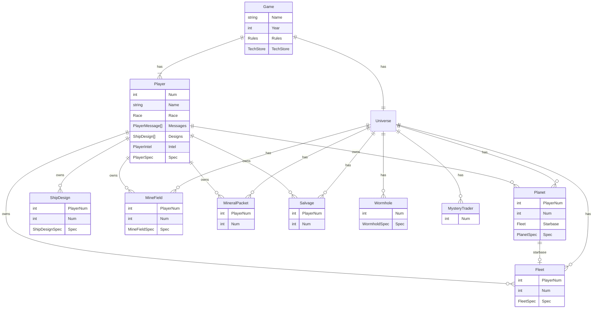
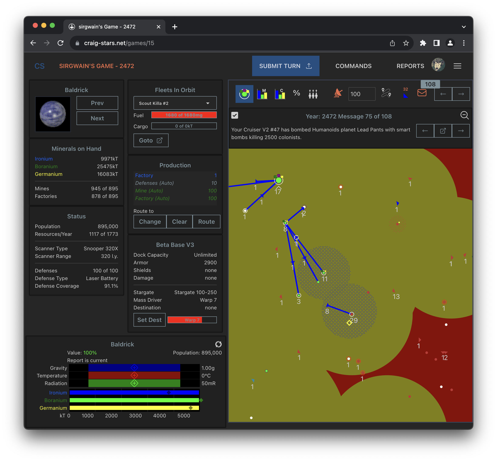

# Architecture

`craig-stars` is a monorepo containing code both for the frontend client and the backend server. The file structure is broken down as follows:

| path        | description                                                                                                                                                                                                             |
| ----------- | ----------------------------------------------------------------------------------------------------------------------------------------------------------------------------------------------------------------------- |
| `/`         | The root folder contains the `main.go` entrypoint into the application.                                                                                                                                                 |
| `/cs`       | All core game logic and models are in the `cs` package. This is also what handles universe and turn generation logic. More details in the [cs](#cs) section                                                             |
| `/db`       | The `db` package handles serializing games to and from the database, as well as any UI database queries. More details in the [db](#db) section.                                                                         |
| `/server`   | The `server` package is where the webserver routes are configured. It also is the "glue" package that ties the game logic together with the database serialization. More details in the [server](#server) section.      |
| `/cmd`      | The `cmd` package is where command line parsing is handled, as well as the entrypoint for serving the application.                                                                                                      |
| `/config`   | The `config` package is craig-stars configuration code lives. This config is loaded from `data/config/config.yaml` and is shared by the database and the server. The config defaults to settings for local development. |
| `/ai`       | The `ai` package is where the logic for ai players resides. The AI strives to be "just another player" with no special insight into the game world.                                                                     |
| `/test`     | The `test` package contains common testing utilities.                                                                                                                                                                   |
| `/frontend` | The `frontend` folder contains all the sveltekit front end code. More details in the [frontend](#frontend) section.                                                                                                     |

## cs

The [cs](/cs) package contains the models and game logic. It contains no serialization logic. There are two main interfaces into the game logic. The [Gamer](/cs/gamer.go) and the [Orderer](/cs/orderer.go). The `Gamer` is used to create games, generate universes and generate new turns. The `Orderer` is used to update player `Research`, `Planet`, `Fleet`, and `MineField` orders, as well as to handle in turn cargo transfers. The `server` makes uses of these interfaces to update game data and save changes back to the database.

### Game Makeup

Every entity in a `craig-stars` game has an integer `Num` associated with it. `Num`s start at 1. Planet #1, Fleet #1, Salvage #1, etc. A value of 0 is considered `None`. Entities that are owned by players also have a `PlayerNum`. If the owner is optional (in the case of a Planet), the `PlayerNum` will be 0.

### Specs

`craig-stars` has a lot of computed values. Planets compute their habitability and growth, ship designs compute their power rating, fleet's compute their cargo capacity and fuel capacity. All computed values are stored in an object's `Spec` field, and are computed by the various `compute*Spec` functions. Specs are computed at the start and end of turns (and sometimes during turns). When players update orders, specs are also recomputed. The spec calculations use the Game's Rules for their various constants.

An example of a `Spec` calculation is the maximum usable factories for a planet, that is dependent on planet population and the race number of factories value.

```go
spec.MaxFactories = planet.population() * race.NumFactories / 10000
```

### Entity Diagram



## db

`craig-stars` uses a sqlite database. sqlite is super performant and easy to manage. It can also be run in memory mode making unit testing a snap. The database is actually split into two databases, a `users.db` and a `data.db`. The thought behind this was that the games database would be reset, but users would retain their logins and their races. The database has never been reset, so this wasn't necssary after all. Oh well.

Because sqlite is file based, in the future it may be updated to use a separate file per game, but for now a single db is working great.

The schema for the database is embedded with `go:embed`. When the server starts up, it checks for new sql schema files and [migrates](/db/migrate.go) the database. When creating new schema files, they must be added to both the [schema/games](/db/schema/games) folder and the [schema/memory](/db/schema/memory) folder. The memory folder is used during unit tests.

There is also an [upgrade.go](/db/upgrade.go) that handles game logic updates, for example adding AR planet internal scanners, or adding artifacts. Any changes that require data changes to existing games can be made as an upgrade step here.

### json in the database

Rather than create a unique column for every single value stored by `craig-stars`, many things are serialized as json blocks and put into the database as text. This makes it easier to update the schema. For objects that don't need to be independently queried from the DB, a json schema is generally used. Some examples of this are the various Specs, and a Player's Race.

## server

The [server](/server) package contains the backend [server](/server/server.go) and the [GameRunner](/server/gamerunner.go). The backend http server handles all `/api` requests from the front end. Routes for various resources are defined in their own files ([fleets.go](/server/fleets.go), [planets.go](/server/planets.go), etc).

The [GameRunner](/server/gamerunner.go) hooks up the [Gamer](/cs/gamer.go) with the database. The `GameRunner` hosts new games, updates game players, and generates new turns on when player's submit their turns. The `GameRunner` also loads a player's game information from the database.


## frontend

The [frontend](/frontend) is a static SvelteKit site that loads game information from the backend `/api` endpoint and displays it to the user. The `frontend` also handles updating changes to player research, planet, fleet, and mine field orders by calling endpoints on the `/api`.

### Game View

The main [game view](</frontend/src/routes/(user)/games/(game)/[id]/(main)/Game.svelte>) is split into sections.



| section      | description                                                          |
| ------------ | -------------------------------------------------------------------- |
| Scanner      | The zoomable and pannable map display of the universe                |
| Command Pane | Tiles with information about the currently commanded planet or fleet |
| Summary Pane | A small summary about the currently selected map object              |

### frontend structure

| path     | description                                                                                                                                                                                                                                                                              |
| -------- | ---------------------------------------------------------------------------------------------------------------------------------------------------------------------------------------------------------------------------------------------------------------------------------------- |
| `css`    | Contains tailwind `@apply` overrides and the various icon classes for techs and planets                                                                                                                                                                                                  |
| `lib`    | `lib` contains type definitions for server side models, Service classes for interacting with the backend `/api`, and any reusauble components (components that exist outside of a single page)                                                                                           |
| `routes` | `routes` contains all the user accessible routes for the application. Almost all routes require the user to be logged in and are in the `(user)` route group. The main game view is located under [src/routes/(user)/games/(game)/[id]](</frontend/src/routes/(user)/games/(game)/[id]>) |

### stores

Webapps are all about reactivity. When the user makes a change or some new data is loaded from the server, the front end needs to react to this new data and update a portion of the page. Svelte uses special [`$`](https://svelte.dev/docs/svelte-components#script-3-$-marks-a-statement-as-reactive) character to denote an inline store or the [store](https://svelte.dev/docs/svelte-store) types. `craig-stars` makes use of stores, along with [contexts](https://svelte.dev/docs/svelte#setcontext) to ensure the components update when their data change. For example, if cargo is transferred from a planet to a fleet, the planet minerals tile needs to update.

Every component under under the game route (`/games/[id]`) has access to a context:

```ts
type GameContext = {
  game: Readable<FullGame>;
  player: Readable<Player>;
  universe: Readable<Universe>;
  settings: Writable<PlayerSettings>;
  messageNum: Writable<number>;
  ... and more
};

// accessed like this
const { game, player, universe, settings } = getGameContext();
```

This context contains reactive stores with the state of the game, for example a component like this would automatically update the game year when it was updated by the server.

```html
<script lang="ts">
  import { getGameContext } from '$lib/services/Contexts';

  const { game, player, universe } = getGameContext();
</script>

<h1>{game.year}</h1>
```

`craig-stars` frontend code makes great use of contexts and stores to update the UI and keep components small.

The `GameContext` is used to react to state changes (`$game.year` updates each time a turn is generated). It also contains methods to update the state, such as `commandPlanet()` or `updatePlayerOrders()`. 

Planets and Fleets owned by the player can be Commanded, at which point they show up in the Command Pane. All map objects can be Selected, at which point they show up in the Selection Summary.

A single click selects a map object. A second click commands the map object if it is owned by the player. Commanded map objects can have their orders changed by the player.

- `CommandedPlanet` - The currently commanded planet, or undefined if no planet is commanded.
- `CommandedFleet` - The currently commanded fleet, or undefined if no planet is commanded.
- `SelectedMapObject` - The currently selected map object, or undefined if no map object is selected.
